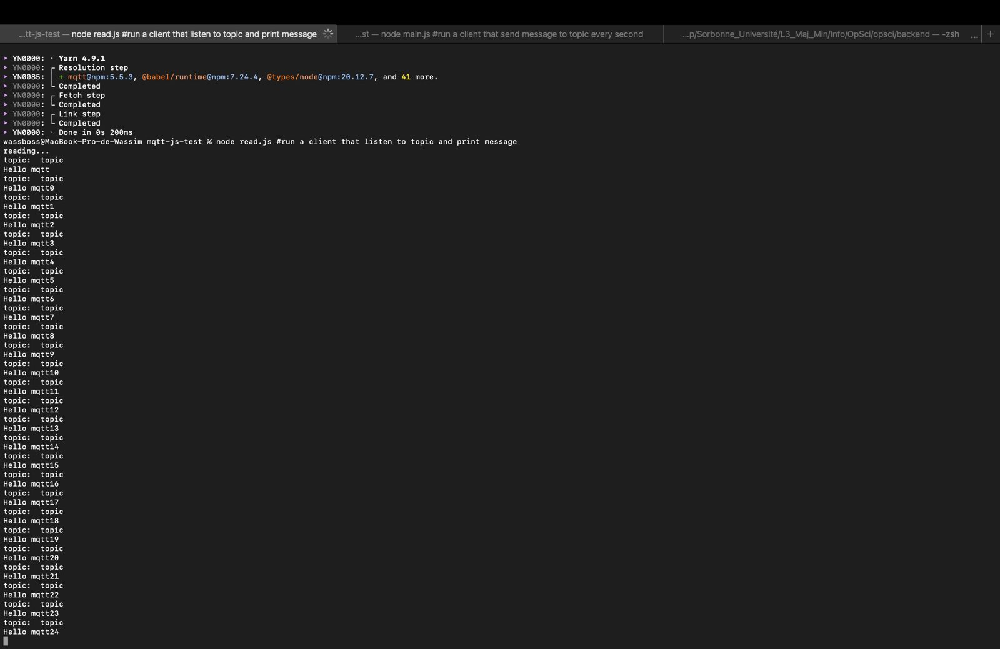

### Membres du groupe
**28705877 - Wassim BOUZIDI**
**21203820- Misasoa ROBISON**
# TME 10 - 11 OPSCI: Internet des objets


## Arborescence du dépôt Git

```
.
├── Images/                    # images utilisées pour illustration
|   └──Screen              
├── mosquitto/ 
|   └──config
|   |   └──mosquitto.conf      #fichier demandé
|   └──data
|   |   └──mosquitto.db        #la database
|   └──log               
├── scripts/
|   └──scripts.sh                       
├── docker-compose.yml          # Configuration des services Docker                  
├── Dockerfile
└── README.md                   # Ce fichier
```
## Installation

### 1. Déploiement de Mosquitto (MQTT Broker)

Créer un dossier mosquitto avec trois sous-dossier : config, data pour la db et log
Créer un fichier `mosquitto.conf` dans config:

```conf
persistence true
persistence_location /mosquitto/data/
log_dest file /mosquitto/log/mosquitto.log
allow_anonymous true
listener 1883
protocol websockets
```

Ajouter les services dans docker-compose.yml et lancer le/les container
```bash
docker compose up -d --build
```

### 2. Connecter MQTT à Kafka

Déployer un conteneur pouvant communiquer avec MQTT et Kafka
```bash
docker pull arthurescriou/mqtt-kafka-connector:1.0.0
cd mqtt-js-tests
yarn
node read.js
```

 
 Ceci montre qu'il y a bien une connexion entre les deux

### 3. Tester
 On peut tester sur : [https://mqtt-test-front.onrender.com/](https://mqtt-test-front.onrender.com/)
 
 
 ***NOTE IMPORTANTE : même avec les conteneurs lancés sans problème et en inspectant les logs qui montraient bien la connexion, les stocks sur strapi ne parvenaient pas à être modifiés via le web***

